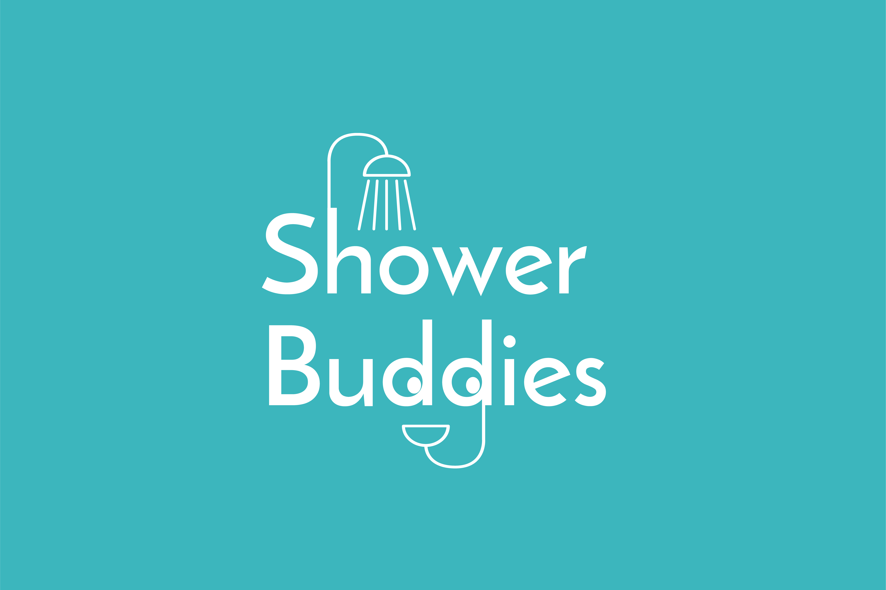

  

# ShowerBuddies
A Raspberry Pi app to monitor water usage in the shower.

## Inspiration
We originally planned to make an app to find people nearby to take a shower with, but after realizing the questionable societal implications, we pivoted to a Raspberry Pi dashboard app to measure water usage in the shower. As freshmen who live in residential halls, we also saw how a system like ours could help encourage users of a shared shower to spend less time in the shower by _gamifying_ the shower taking process.

## What it does
ShowerBuddies uses a Raspberry Pi with a water flow sensor attached to push water usage data through a local Node server.

## How we built it
ShowerBuddies was built using a Raspberry Pi 3, a water flow sensor, and JavaScript. We connected the water flow sensor to the Raspberry Pi and manipulated Node packages for water flow sensors until we could write the contents of the output into a JavaScript file. From the file, we launched a Node.js server, and accessed the data via a LAN connection from the Raspberry Pi to a laptop. The total amount of water, in gallons, is then outputted to the console.

## Challenges we ran into
When initially trying to run both the client and server-side code on the Raspberry Pi, we ran into compute power limitations.

## Accomplishments that we're proud of
- Attending our first hackathon and submitting a project as college freshmen.

## What we learned
- practical application of sockets, servers, and general networking
- the ins-and-outs of Node.js and JavaScript frameworks

## What's next for ShowerBuddies
The next step for ShowBuddies is to integrate it into a desktop application using Electron JS. In addition, we would like to implement user specific information, and more statistics on water usage from showering.
